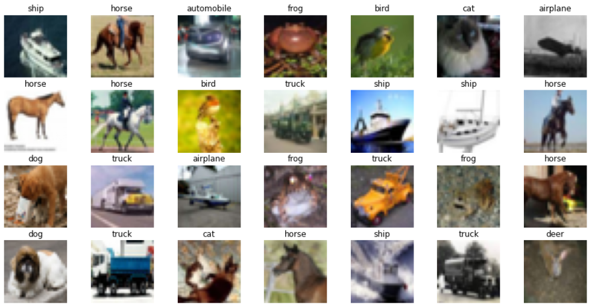
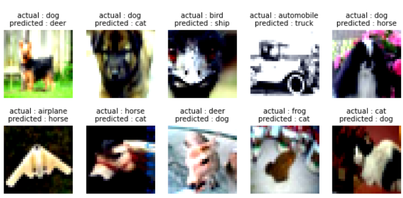
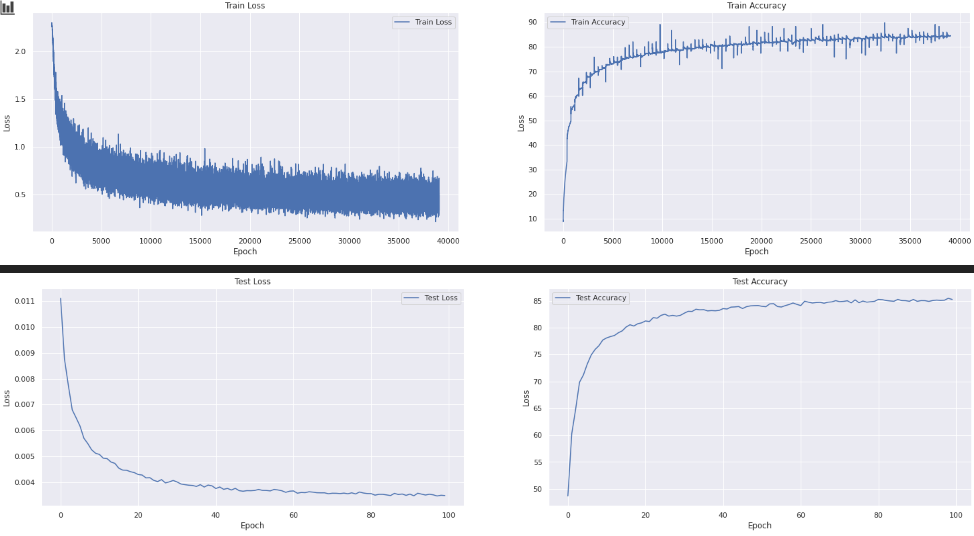

# ADVANCED CONCEPTS

> Here we have demonstrated a network that gives 85%+ accuracy on CIFAR10 dataset  

Concepts used:
 - Convolution 
 - Dialated Kernels
 - Global Average Pooling
 - Image Augmentation usinig Albumentations
 - Depthwise seperable convolution


Overview of dataset:  



Augmentations used:
 - Horizontal Flip
 - Grey
 - Shift, Scale, Rotate
 - Coarse Dropout

Model Summary:

```
----------------------------------------------------------------
        Layer (type)               Output Shape         Param #
================================================================
            Conv2d-1           [-1, 32, 32, 32]             864
              ReLU-2           [-1, 32, 32, 32]               0
       BatchNorm2d-3           [-1, 32, 32, 32]              64
         Dropout2d-4           [-1, 32, 32, 32]               0
            Conv2d-5           [-1, 32, 32, 32]           9,216
              ReLU-6           [-1, 32, 32, 32]               0
       BatchNorm2d-7           [-1, 32, 32, 32]              64
         Dropout2d-8           [-1, 32, 32, 32]               0
            Conv2d-9           [-1, 32, 15, 15]           9,248
             ReLU-10           [-1, 32, 15, 15]               0
      BatchNorm2d-11           [-1, 32, 15, 15]              64
        Dropout2d-12           [-1, 32, 15, 15]               0
           Conv2d-13           [-1, 32, 15, 15]           9,216
             ReLU-14           [-1, 32, 15, 15]               0
      BatchNorm2d-15           [-1, 32, 15, 15]              64
        Dropout2d-16           [-1, 32, 15, 15]               0
           Conv2d-17           [-1, 32, 15, 15]             288
           Conv2d-18           [-1, 32, 17, 17]           1,024
             ReLU-19           [-1, 32, 17, 17]               0
      BatchNorm2d-20           [-1, 32, 17, 17]              64
        Dropout2d-21           [-1, 32, 17, 17]               0
           Conv2d-22             [-1, 32, 8, 8]           9,248
             ReLU-23             [-1, 32, 8, 8]               0
      BatchNorm2d-24             [-1, 32, 8, 8]              64
        Dropout2d-25             [-1, 32, 8, 8]               0
           Conv2d-26             [-1, 64, 6, 6]          18,432
             ReLU-27             [-1, 64, 6, 6]               0
      BatchNorm2d-28             [-1, 64, 6, 6]             128
        Dropout2d-29             [-1, 64, 6, 6]               0
           Conv2d-30             [-1, 64, 6, 6]          36,864
             ReLU-31             [-1, 64, 6, 6]               0
      BatchNorm2d-32             [-1, 64, 6, 6]             128
        Dropout2d-33             [-1, 64, 6, 6]               0
           Conv2d-34             [-1, 64, 2, 2]          36,928
             ReLU-35             [-1, 64, 2, 2]               0
      BatchNorm2d-36             [-1, 64, 2, 2]             128
        Dropout2d-37             [-1, 64, 2, 2]               0
           Conv2d-38             [-1, 64, 2, 2]          36,864
             ReLU-39             [-1, 64, 2, 2]               0
      BatchNorm2d-40             [-1, 64, 2, 2]             128
        Dropout2d-41             [-1, 64, 2, 2]               0
           Conv2d-42             [-1, 64, 2, 2]             576
           Conv2d-43             [-1, 10, 4, 4]             640
AdaptiveAvgPool2d-44             [-1, 10, 1, 1]               0
================================================================
Total params: 170,304
Trainable params: 170,304
Non-trainable params: 0
----------------------------------------------------------------
Input size (MB): 0.01
Forward/backward pass size (MB): 3.00
Params size (MB): 0.65
Estimated Total Size (MB): 3.66
----------------------------------------------------------------
```

Receptive Field calculation:

| n_in | k | p | s | n_out | j_in | j_out | r_in | r_out | dilation |
|------|---|---|---|-------|------|-------|------|-------|----------|
| 32   | 3 | 1 | 1 | 32    | 1    | 1     | 1    | 3     | 1        |
| 32   | 3 | 1 | 1 | 32    | 1    | 1     | 3    | 5     | 1        |
| 32   | 3 | 0 | 2 | 15    | 1    | 2     | 5    | 7     | 1        |
| 15   | 3 | 1 | 1 | 15    | 2    | 2     | 7    | 11    | 1        |
| 15   | 3 | 1 | 1 | 15    | 2    | 2     | 11   | 15    | 1        |
| 15   | 3 | 1 | 1 | 17    | 2    | 2     | 15   | 19    | 1        |
| 17   | 3 | 0 | 2 | 8     | 2    | 4     | 19   | 23    | 1        |
| 8    | 3 | 1 | 1 | 6     | 4    | 8     | 23   | 39    | 2        |
| 6    | 3 | 1 | 1 | 6     | 8    | 8     | 39   | 55    | 1        |
| 6    | 3 | 0 | 2 | 2     | 8    | 16    | 55   | 71    | 1        |
| 2    | 3 | 1 | 1 | 2     | 16   | 16    | 71   | 103   | 1        |
| 2    | 3 | 1 | 1 | 2     | 16   | 16    | 103  | 135   | 1        |
| 2    | 1 | 1 | 1 | 4     | 16   | 16    | 135  | 135   | 1        |


**Files Used:**
- Notebook for training : [CIFAR10_Classification_modular.ipynb](EVA6-Phase1-Assignments/Session7_Advanced_Concepts/CIFAR10_Classification_modular.ipynb)
- Model File : [model.py](EVA6-Phase1-Assignments/Session7_Advanced_Concepts/model.py)
- Transformations used : [transforms.py](EVA6-Phase1-Assignments/Session7_Advanced_Concepts/transforms.py)
- Training scripts : [trainer.py](EVA6-Phase1-Assignments/Session7_Advanced_Concepts/trainer.py)
- Utilities : [utils.py](EVA6-Phase1-Assignments/Session7_Advanced_Concepts/utils.py)
- Cifar Data analysis : [CIFAR10_EDA.ipynb](EVA6-Phase1-Assignments/Session7_Advanced_Concepts/CIFAR10_EDA.ipynb)


## **Model Analysis:**  


**Missclassified Images:**

  


**Training curves**




**Accuracy Per class:**

```
Accuracy of airplane : 88 %
Accuracy of automobile : 93 %
Accuracy of  bird : 76 %
Accuracy of   cat : 68 %
Accuracy of  deer : 84 %
Accuracy of   dog : 76 %
Accuracy of  frog : 91 %
Accuracy of horse : 89 %
Accuracy of  ship : 91 %
Accuracy of truck : 91 %
```

### Authors:
- Shreeyash Pawar
- Haswanth Aekula
- Raja Rajendran


