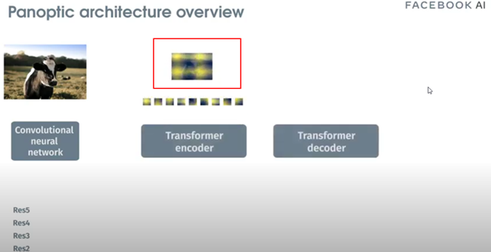
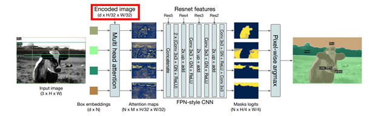
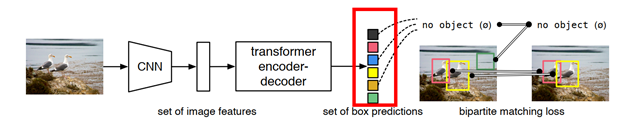
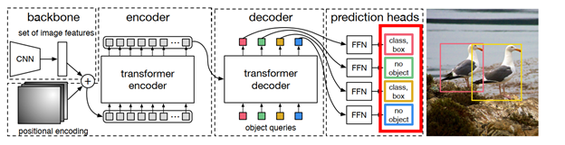
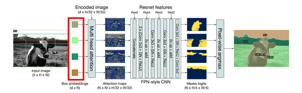
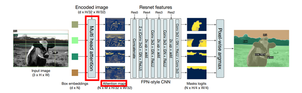
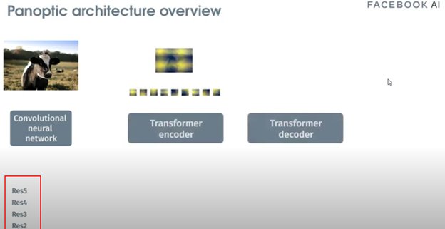
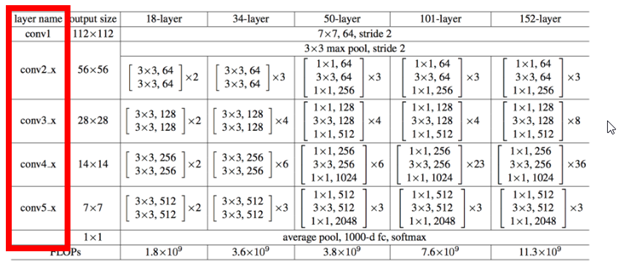
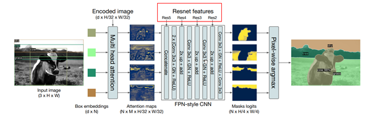
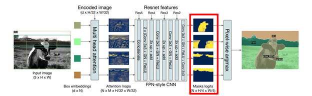

- [1. Capstone Assignment 1](#1-capstone-assignment-1)
  - [1.1. We take the encoded image (dxH/32xW/32) and send it to Multi-Head Attention (FROM WHERE DO WE TAKE THIS ENCODED IMAGE?)](#11-we-take-the-encoded-image-dxh32xw32-and-send-it-to-multi-head-attention-from-where-do-we-take-this-encoded-image)
  - [1.2. We also send dxN Box embeddings to the Multi-Head Attention](#12-we-also-send-dxn-box-embeddings-to-the-multi-head-attention)
  - [1.3. We do something here to generate NxMxH/32xW/32 maps. (WHAT DO WE DO HERE?)](#13-we-do-something-here-to-generate-nxmxh32xw32-maps-what-do-we-do-here)
  - [1.4. Then we concatenate these maps with Res5 Block (WHERE IS THIS COMING FROM?)](#14-then-we-concatenate-these-maps-with-res5-block-where-is-this-coming-from)
  - [1.5. Then we perform the above steps (EXPLAIN THESE STEPS)](#15-then-we-perform-the-above-steps-explain-these-steps)
  - [1.6. And then we are finally left with the panoptic segmentation](#16-and-then-we-are-finally-left-with-the-panoptic-segmentation)

# 1. Capstone Assignment 1

## 1.1. We take the encoded image (dxH/32xW/32) and send it to Multi-Head Attention (FROM WHERE DO WE TAKE THIS ENCODED IMAGE?)

The encoded image is taken from the output of the 'Transformer Encoder' during bounding box detection using DETR.
- The input image is passed through the CNN, which is the RESNET backbone.
- And the output of the RESNET backbone are the low resolution activation maps.
- These activation maps are used as embedding vectors/input to the Transformer Encoder.
- The transformer Encoder outputs attention vectors from this input.
- The output of the encoder is assembled back into an encoded image (see image below).

  

This is the encoded image that is used as an input to the ‘multi attention head’ in the panoptic segmentation mask head.

  
 
## 1.2. We also send dxN Box embeddings to the Multi-Head Attention

These are the ‘N’ bounding boxes for the objects detected in the input image by DETR.  See image below where DETR outputs the bounding boxes for things, stuff and ‘no object’.  

The ‘no objects’ are discarded and only the object bounding boxes (bounding boxes for things and stuff) are fed as an input to the ‘multi-head attention’ of the ‘mask head’ (which does the panoptic segmentation task) 

## 1.3. We do something here to generate NxMxH/32xW/32 maps. (WHAT DO WE DO HERE?)

`Multi head attention` is performed to generate the NxMxH/32xW/32 attention maps as shown below.  This returns the attention scores over the encoded image for each object embedding (bounding box predicted by DETR).. The output of this are the attention maps shown below.  

From the paper:
> It takes as input the output of transformer decoder for each object and computes multi-head (with M heads) attention scores of this embedding over the output of the encoder, generating M attention heatmaps per object in a small resolution.

## 1.4. Then we concatenate these maps with Res5 Block (WHERE IS THIS COMING FROM?)

The Res5, Res4, Res3, Res2 are the intermediate activation maps (the outputs of the resnet blocks) from the RESNET backbone.  Note that these are intermediate outputs, obtained when the input image is processed using RESNET in DETR, to get the low resolution activation maps needed as input to the ‘transformer encoder’.  See images below

During panoptic segmentation, these intermediate activation maps (output of intermediate RESTNET blocks) will be used as input to the FPN CNN network.  See image shown below

## 1.5. Then we perform the above steps (EXPLAIN THESE STEPS)
The input ‘attention maps’ are upsampled and cleaned using the FPN-style CNN, which results in high resolution mask logits at the output of the CNN.  There is one binary mask for each attention map (bounding box): a value of ‘1’ in the mask indicates that this pixel is part of this object and ‘0’ indicates that it is not part of this object..  The image below shows the individual binary masks obtained by upsampling and cleaning (done by the CNN) of the activation maps.

Finally each individual mask is merged into a single panoptic segmentation mask using pixel-wise argmax.

## 1.6. And then we are finally left with the panoptic segmentation

