- [1. what is your code all about, (what the notebook does; what model.py is doing)](#1-what-is-your-code-all-about-what-the-notebook-does-what-modelpy-is-doing)
- [2. how to perform the 3 covered normalization (cannot use values from the excel sheet shared).. take the same excel sheet.. and change the values.. actually random values are used.. so if you close i and open it, new values will show up](#2-how-to-perform-the-3-covered-normalization-cannot-use-values-from-the-excel-sheet-shared-take-the-same-excel-sheet-and-change-the-values-actually-random-values-are-used-so-if-you-close-i-and-open-it-new-values-will-show-up)
  - [2.1. Normalization types](#21-normalization-types)
  - [2.2. Formula](#22-formula)
  - [2.3. Implementation](#23-implementation)
- [3. show all 3 calculations for  4 sample 2x2 images (image shown in the content has 3 images); so batch size is 4 and not 3](#3-show-all-3-calculations-for--4-sample-2x2-images-image-shown-in-the-content-has-3-images-so-batch-size-is-4-and-not-3)
- [4. your findings for normalization techniques, (LN, BN, GN).. how they are helping you or constraining you](#4-your-findings-for-normalization-techniques-ln-bn-gn-how-they-are-helping-you-or-constraining-you)
- [5. add all your graphs](#5-add-all-your-graphs)
- [6. your 3 collection-of-misclassified-images](#6-your-3-collection-of-misclassified-images)
  - [6.1. Incorrect image predictions for NN with group normalization and layer1 regularization](#61-incorrect-image-predictions-for-nn-with-group-normalization-and-layer1-regularization)
  - [6.2. Incorrect image predictions for NN with layer normalization and layer2 regularization](#62-incorrect-image-predictions-for-nn-with-layer-normalization-and-layer2-regularization)
  - [6.3. Incorrect image predictions for NN with batch normalization, layer 1 and layer 2 regularization](#63-incorrect-image-predictions-for-nn-with-batch-normalization-layer-1-and-layer-2-regularization)

## 1. what is your code all about, (what the notebook does; what model.py is doing)

The code is moduralized as described below:

- the model is defined in a separate python module: [assignment_6_model.py](assignment_6_model.py)
  - the 'norm_layer_type` argument in the constructor defines the type of normalization that the mdel will perform

  ```python
        def __init__(self, norm_layer_type, num_groups_for_group_norm=None):
            """
            norm_layer_type: 'batch' | 'group' | 'layer'
            """
  ```

- the notebook defines the rest of the logic including the code for loading, training, testing and plotting: [assignment_6_batch_norm_regularization.ipynb](assignment_6_batch_norm_regularization.ipynb)

## 2. how to perform the 3 covered normalization (cannot use values from the excel sheet shared).. take the same excel sheet.. and change the values.. actually random values are used.. so if you close i and open it, new values will show up

### 2.1. Normalization types

Batch Normalization

- Normalize each channel, in each layer (of NN), across all images

Layer Normalization

- Normalize all channels, in each layer (of NN), for each image

Group Normalization

- Normalize a group of channels, in each layer (of NN), for each image

### 2.2. Formula

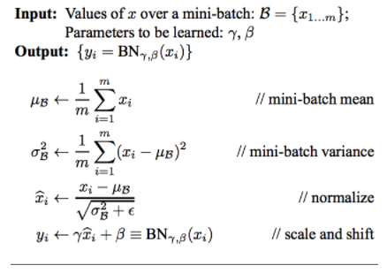  

### 2.3. Implementation

Shows how the normalization tyeps are implemented.  For details see [assignment_6_model.py](assignment_6_model.py)

```python
def get_norm_layer( norm_layer_type, num_channels, num_groups_for_group_norm=None):
    """
    norm_layer_type: 'batch' | 'group' | 'layer'
    num_channels: # of channels
    """
    if norm_layer_type == "batch":
        # Applies Batch Normalization over a 4D input (a mini-batch of 2D inputs with additional channel dimension) as described in the paper Batch Normalization: Accelerating Deep Network Training by Reducing Internal Covariate Shift <https://arxiv.org/abs/1502.03167>__ .        #
        # The mean and standard-deviation are calculated per-dimension over the mini-batches and \gamma and \beta are learnable parameter vectors of size C (where C is the input size). By default, the elements of \gamma are set to 1 and the elements of \beta are set to 0. The standard-deviation is calculated via the biased estimator, equivalent to torch.var(input, unbiased=False).        #
        # def __init__(num_features, eps=1e-05, momentum=0.1, affine=True, track_running_stats=True)
        nl = nn.BatchNorm2d(num_features=num_channels)
    elif norm_layer_type == "group":
        # Applies Group Normalization over a mini-batch of inputs as described in the paper Group Normalization
        # The input channels are separated into num_groups groups, each containing num_channels / num_groups channels. The mean and standard-deviation are calculated separately over the each group. \gammaγ and \betaβ are learnable per-channel affine transform parameter vectors of size num_channels if affine is True. The standard-deviation is calculated via the biased estimator, equivalent to torch.var(input, unbiased=False).
        nl = nn.GroupNorm(num_groups=num_groups_for_group_norm, num_channels=num_channels)
    elif norm_layer_type == "layer":
        # a group size of '1' uses all the 'features'/channels of the image: essentially a 'layer norm'
        nl = nn.GroupNorm(num_groups=1, num_channels=num_channels)

    return nl
```

## 3. show all 3 calculations for  4 sample 2x2 images (image shown in the content has 3 images); so batch size is 4 and not 3

## 4. your findings for normalization techniques, (LN, BN, GN).. how they are helping you or constraining you

- We observed that that among the 3 types of normalizations, Batch Normalization had the highest test accuracy and lowest training loss.  So compared to the other 2, it performed the best.
- The train loss for batch normalization was higher compared to the other two.  This could be due to the fact that both L1 and L2 regularziations were applied, which make the training harder (this is the intent of regularization which is to avoid overfitting).  As a result, the training losses were high.

## 5. add all your graphs

from [assignment_6_batch_norm_regularization.ipynb](assignment_6_batch_norm_regularization.ipynb)

<!-- 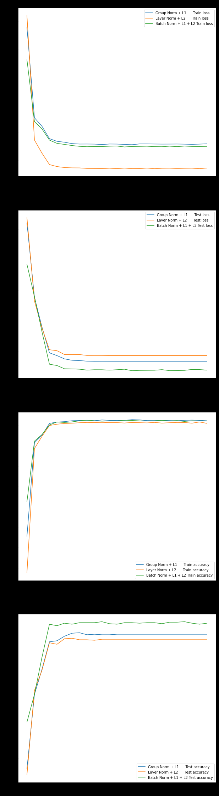  
   -->

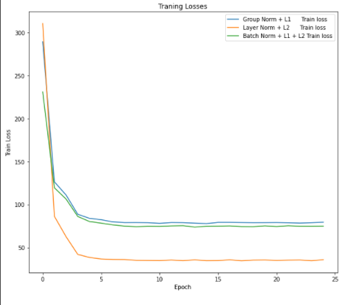  

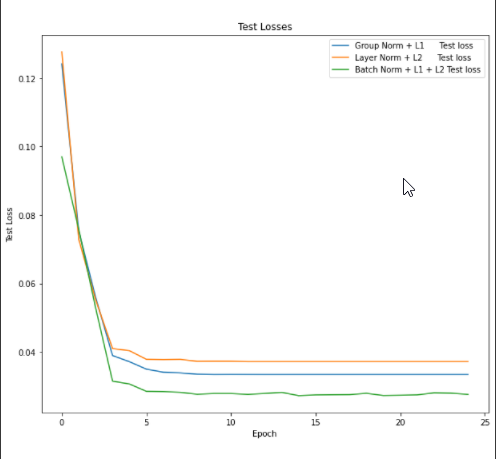  

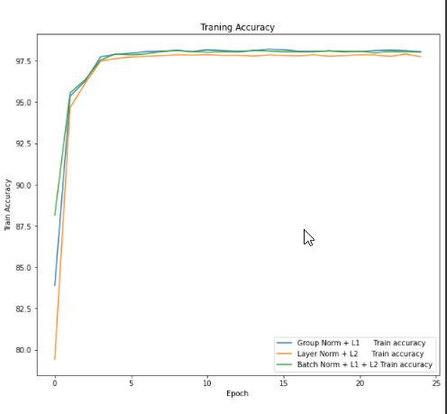  

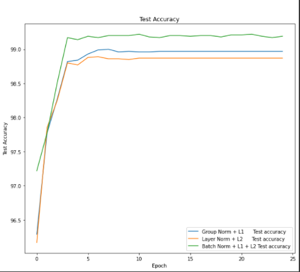  

## 6. your 3 collection-of-misclassified-images

from [assignment_6_batch_norm_regularization.ipynb](assignment_6_batch_norm_regularization.ipynb)

### 6.1. Incorrect image predictions for NN with group normalization and layer1 regularization

<!-- 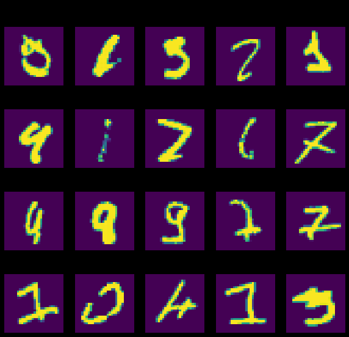  -->

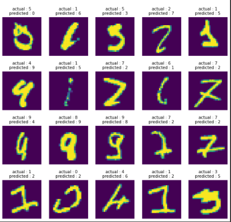  

### 6.2. Incorrect image predictions for NN with layer normalization and layer2 regularization

<!-- 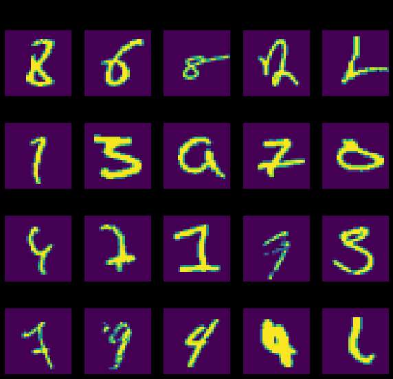   -->
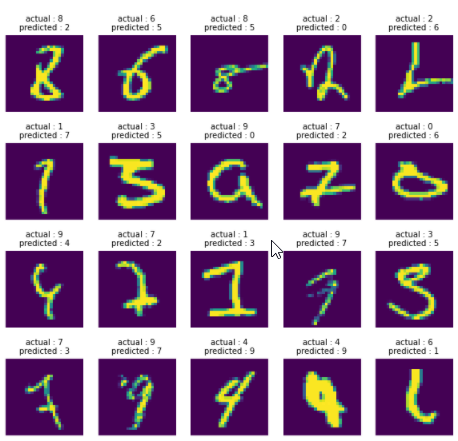  

### 6.3. Incorrect image predictions for NN with batch normalization, layer 1 and layer 2 regularization

<!-- 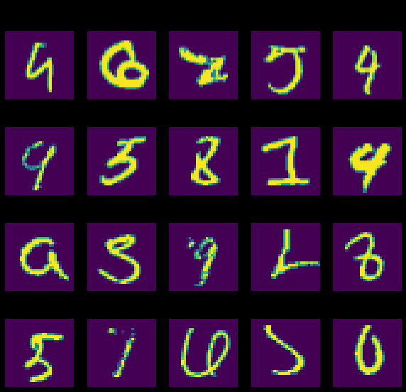   -->
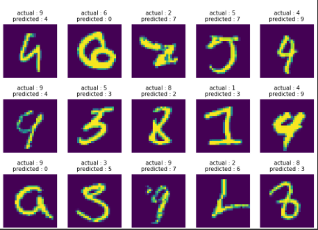  
